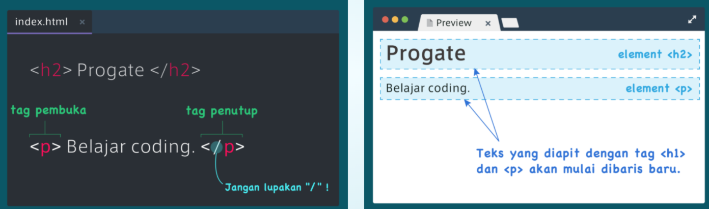

# HTML
Aturan penulisan HTML adalah mengapit teks dengan tag. Selalu memiliki tag pembuka ```<pembuka>``` dan tag penutup ```</pembuka>```. Contoh: ```<h1>TEKS</h1>```. Berikut adalah beberapa tag dasar yang digunakan pada HTML.
- **Tag Header**  
Tag header atau judul bervariasi dari ```<h1>JUDUL</h1>``` hingga ```<h6>SUB JUDUL 6</h6>```. "h" pada tag itu sendiri mewakili "Header".
- **Tag Paragraph**  
Tag paragraf ditandai dengan ```<p>```. "p" mewakili "Paragraph".  
Contoh: ```<p>paragraf html</p>```.  

- **Tag Link**  
Tag Link atau tautan ditandai dengan ```<a>``` atau "anchor". Digunakan dalam format ```<a url="url yang dituju">tautan</a>```.  
Contoh: ```<a url="google.com">google</a>```
- **Tag Image**  
Tag image atau gambar biasa digunakan untuk memasukkan gambar kedalam laman html. Gambar bukanlah teks sehingga tidak perlu mengapit tag ``````. Dengan format ``````.  Contoh: ``````
- **Tag List**  
Tag list digunakan untuk membuat daftar. berikut adalah cara penggunaan list dimana tag ```<li>``` akan diapit oleh tag ```<ul>```. 
  ```
  <ul>
    <li>List 1</li>
    <li>List 2</li>
    <li>List 3</li>
  <ul>
  ```  
  .
  
# CSS
CSS dapat merubah tata letak html dan merubah komposisi warna, ukuran, jenis font yang dipakai dan lain lain.
